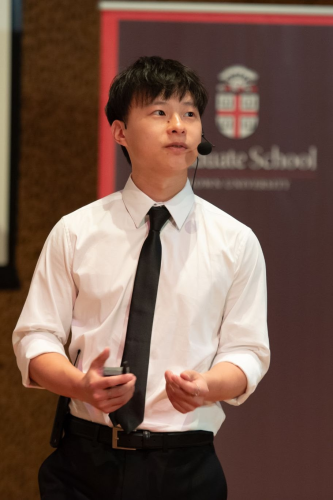

<html lang = "en">
<body>

  
  

<h3>About me</h3>
    

  I obtained my PhD in applied mathematics at Brown University in 2025 under the supervision of <a href = "https://appliedmath.brown.edu/people/kavita-ramanan">Kavita Ramanan</a>. Starting July 1, 2025, I will be a <a href = "https://www.simonsfoundation.org/simons-society-of-fellows/people/?type=junior">Junior Fellow</a> of the Simons Society of Fellows hosted by <a href = "https://www.columbia.edu/~dl3133/">Dan Lacker</a> at Columbia University.Click <a href="CV__April_2025_.pdf" target="_blank" rel="noopener noreferrer">here</a> for a CV.

My research interests lie at the intersection of probability theory and mathematical physics. In my thesis, I studied propagation of chaos and the long-time behavior of sparsely interacting particle systems. A short general audience talk about my research can be found <a href = "https://www.youtube.com/watch?v=i2yfnAhQmWA">here</a>.

You can reach me at kjh2189[at]columbia.edu. 

 

   

<h2>Research</h2>

    <a href = "https://scholar.google.com/citations?user=G5ycrVsAAAAJ&hl=en&oi=sra">Google Scholar</a>

<b>A case study of the long-time behavior of the Gaussian local-field equation</b>  
Kevin Hu, Kavita Ramanan.  
Preprint, 2025. Submitted. [<a href = "https://arxiv.org/abs/2504.06449">arXiv</a>]

<b>An H-theorem for a conditional McKean-Vlasov process related to interacting diffusions on regular trees</b>  
Kevin Hu, Kavita Ramanan.  
Preprint, 2024. Submitted. [<a href = "https://arxiv.org/abs/2412.07710">arXiv</a>]

<b>A Mimicking Theorem for processes driven by fractional Brownian motion</b>  
Kevin Hu, Kavita Ramanan, William Salkeld.  
Preprint, 2024. [<a href = "https://arxiv.org/abs/2405.08803">arXiv</a>]

<b>The fundamental martingale with applications to Markov random fields</b>  
Kevin Hu, Kavita Ramanan, William Salkeld.  
Preprint, 2024. [<a href = "https://arxiv.org/abs/2405.08795">arXiv</a>]

<b>The role of shape-dependent flight stability in the origin of oriented meteorites</b>  
Khunsa Amin, Jinzi Mac Huang, Kevin Hu, Jun Zhang, Leif Ristroph.  
<i>Proceedings of the National Academy of Sciences</i>, 2019. [<a href = "https://www.pnas.org/doi/full/10.1073/pnas.1815133116">DOI</a>]

</body>

</html>
